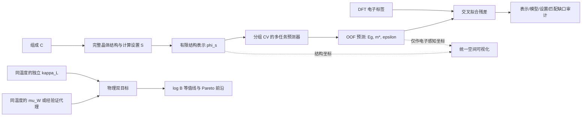

# 从“对称多视图”到“不对称结构编码—性质预测”

> 方法修订稿，2026-08-28。本文定义下一阶段的科学问题、数据口径、泄漏审计和作图规范。
> 在这些门槛通过前，旧版“高电子输运簇/低 κL 簇”只保留为失败案例，不作为材料结论。

## 摘要

本项目不再把结构视图与电子视图解释为同一潜变量的两个对称噪声观测。对给定的完整晶体状态、
磁性/缺陷构型和计算协议，DFT 电子性质原则上由这些输入决定；因此有限结构描述符无法预测的部分
不是“物理上的电子私有自由度”，而是**结构表示、预测模型、计算设置、跨库匹配和数值误差的合成缺口**。

主要问题改为：

1. 组成表示能预测多少 `Eg`、`m*`、`ε`？
2. 在相同的化学体系外推划分上，加入几何结构后有多少配对增益？
3. 这种增益能否在不同模型、不同电子目标和不同数据子集上复现？

只有第 2、3 项通过预注册门槛后，才训练统一的“电子感知结构表示”。rCCA/MFA 可用于对齐检查和
可视化，但不承载主要物理论断。

热电筛选目标也改写为同温度下的加权迁移率与晶格热导率：

\[
\log B(T)=C+\log \mu_W(T)+\frac{5}{2}\log T-\log \kappa_L(T).
\]

这里的分解是单抛物带近似下的有用参数化，不意味着 `μW` 与 `κL` 在统计或因果上独立。当前
JARVIS 数据给出 CRTA 的 `σ/τ`、`κe/τ`；没有材料相关的 `τ` 或实测电阻率时，只能得到
`μW/τ` 和 `B/τ` 型代理，不能给出绝对 `μW`、绝对 `B` 或候选材料排名。

## 1. 修订后的逻辑结构

这个图刻意不画 `electronic-private` 节点。对电子性质 `y_e`，主模型写为

\[
\hat y_e=f\!\left(\phi_s(S)\right),\qquad
r_e=y_e-\hat y_e^{\mathrm{OOF}}.
\]

`r_e` 必须来自 out-of-fold 预测。它量化当前工作流的未解释部分，至少同时包含：

- `φs` 未编码的长程、对称性、化学环境或磁性信息；
- 模型容量和训练样本覆盖不足；
- DFT 泛函、SOC、磁序、数值收敛等协议差异；
- MP–JARVIS 结构映射误差和标签噪声。

因此只能称其为“表示缺口”或“不可恢复残差”，不能称为新的电子自由度。

## 2. 标签定义：先固定物理口径，再计算品质因子

### 2.1 主标签

最终材料比较使用同一温度 `T0` 下的连续变量：

- 电子通道：`log μW(T0)`；
- 晶格通道：`−log κL(T0)`；
- 汇总量：`log B(T0)`；
- 多目标展示：最大化 `μW`、最小化 `κL` 的 Pareto 前沿。

在单抛物带记号下，`μW = μ0 (m*DOS/me)^(3/2)`；这里的 `μ0` 是迁移率因子，不是只凭
有效质量就能得到的量。实际多带、各向异性材料应优先从同温度的 Seebeck 与电阻率估算 `μW`，
并把 SPB 结果标作模型近似。

`B` 比“高 PF ∩ 低 κL”更接近材料的本征热电潜力，因为它把可优化载流子浓度与材料质量
区分开。但“与掺杂无关”只能作为 SPB/给定散射模型下的近似：`μW` 仍可能随温度、载流子浓度、
多带效应和散射机制变化。

### 2.2 当前数据能否计算

现有 JARVIS 标签是 600 K、固定载流子浓度下的 BoltzTraP/CRTA 输出。加权迁移率从 `S` 和
电阻率（或绝对 `σ`）推导；用 `σ/τ` 代替 `σ` 只能得到 `μW/τ`。因此当前分析分两层：

1. **表示学习层**：可使用 `Eg`、电子/空穴有效质量、介电张量等 DFT 标签；
2. **热电判定层**：等待同温度的绝对 `σ`/迁移率与独立 `κL`，或先明确标为 `B/τ` 灵敏度分析。

300 K Snyder `κL` 与 600 K 电子输运不得直接合成 `B`。固定掺杂与最优掺杂也必须作为两个
不同任务，文件名、图题和表头都要写明 `T`、载流子类型和载流子浓度。

## 3. 对齐策略：直接 ID 优先，但不能假设只有查表

当前原始 JARVIS 记录中约 43,050 条含旧式 `mp-*` 引用，其中约 21,778 条具有可用输运；
但这些旧 ID 与当前 MP 导出的字母型 `material_id` 没有直接交集。因此采用分层对齐：

1. 从 JARVIS `reference`/metadata 解析原始 MP ID；若存在官方 ID crosswalk，直接查表；
2. 其余记录在**相同规范化化学式**内做结构匹配；
3. 多晶型组内建立两两 RMS 代价矩阵，用一对一分配保留多晶型；
4. 仅当最佳 RMS 通过阈值且相对次优匹配有足够 margin 时接受，否则标记 `ambiguous`；
5. 报告 `direct-id / structural / ambiguous / unmatched` 四类数量和 RMS 分布。

当前 6,553 个“一式一结构”组只可作为匹配器的种子审计集；抽样 300 个中 295 个通过既定
StructureMatcher 阈值，RMS 中位数约 `3.70×10⁻⁶`。这个结果说明结构来源高度重合，但不能据此
删除多晶型。最终模型必须保留可唯一分配的多晶型；“唯一化学式”子集只能做敏感性分析。

由于 JARVIS 条目大量源自 MP/OQMD，这不是独立跨库验证。外推能力只能由 held-out chemical
system、时间切分或真正独立实验/BTE 数据检验。

## 4. 缺失机制和分析队列

在当前 6,553 个种子配对中，主要字段覆盖为：

| 电子标签 | 可用数 | 覆盖率 | 主分析用途 |
|---|---:|---:|---|
| OptB88vdW `Eg` | 6,553 | 100.0% | 主目标 |
| `m*_e` 与 `m*_h` | 5,871 | 89.6% | 目标特异 complete-case |
| OptB88vdW 介电张量 | 6,139 | 93.7% | 主目标 |
| SOC spillage | 4,064 | 62.0% | 嵌套敏感性队列 |
| MBJ `Eg` | 2,969 | 45.3% | 高保真嵌套队列 |
| MBJ 介电张量 | 2,848 | 43.5% | 高保真嵌套队列 |

缺失集中在特定材料类别，不能默认 MCAR。规则如下：

- 每个目标在相同 complete-case 队列上配对比较 `C` 与 `C+G`；
- 核心多任务模型使用 `Eg + m* + ε` 均完整的队列（当前种子集 N=5,498）；
- MBJ、spillage 单独作为嵌套队列，不用均值填补伪造质心；
- 缺失指示变量只用于部署模型的敏感性分析，不能当作物理描述符解释；
- 必须按金属/半导体、磁性、元素族报告入选概率和队列漂移。

## 5. 降维前的泄漏审计

### 5.1 `κL` 梯度

对 Snyder/Slack 型解析目标，先定义解析输入基线 `Pκ`：平均原子质量、原子体积、Debye 温度、
Grüneisen 参数及公式中的其他项。依次比较：

| 模型 | 输入 | 可解释的结论 |
|---|---|---|
| `Pκ` | 解析公式输入 | 代码与数据口径正对照 |
| `C` | 仅组分（Magpie） | 组分可恢复多少模型输入 |
| `C+G0` | 组分 + composition-blind 几何 | 几何相对组分的增量 |
| `C+Gspecies` | 组分 + 带元素身份结构表示 | 完整表示的预测上限 |

若目标本身由 `Pκ` 生成，则 `Pκ` 的高 AUC/R² 是恒等式，完整表示接近它也不是发现。只有在
实验或独立 BTE `κL` 上，`Pκ` 才是有意义的机理基线；此时报告完整表示相对 `Pκ` 的配对增益。

### 5.2 电子梯度

预测 `Eg`、`m*`、`ε` 时，输入不得包含这些目标、同一次计算直接派生的输运标签或其代数变换。
若把 `m*`、`Eg` 放入显示空间后再用由它们近似构成的 PF/`μW` 着色，只能称为机制可视化，
不能据此声称发现新簇。所有“富集”结论必须列出目标与每个输入字段之间的派生关系审计表。

## 6. 一天内完成的判决性实验

### 6.1 特征与目标

- `C`：Magpie/元素统计，不含结构几何；
- `G0`：composition-blind 的晶格、密度、配位、径向/角分布；
- `C+G0`：检验几何相对组分的净增量；
- `Gspecies`：species-aware SOAP/图网络，作为部署上限，不用于单独归因。

目标为 `Eg`、`log m*_e`、`log m*_h`、`log ε`。为避免零值和张量处理制造假分数：

- `Eg` 使用“两阶段”任务：先分类金属/非金属，再只在正带隙样本上回归 `log(1+Eg)`；
- `m*` 只在定义有效且为正的相应载流子子集上取对数；电子、空穴分开建模；
- `ε` 使用介电张量的旋转不变量（如正特征值的对数或对数行列式），不直接拼接坐标系分量；
- 每个目标都冻结自己的分析队列，所有特征组在完全相同的样本与 CV 折上比较。

`log κL` 分开报告：Snyder 只做泄漏正对照，实验/BTE 才能用于科学判决；当前实验
material-level N≈59，功效不足，不能作为整个项目的否决门。

### 6.2 交叉验证

1. 外层按排序后的元素集合 `chemical_system` 分组，使用相同的 repeated GroupKFold；
2. 超参数只在外层训练折内选择；
3. 同时跑 Ridge/Elastic Net 与一个固定的非线性模型，避免结论依赖单一模型容量；
4. 每个折记录 `R²`、MAE、Spearman；
5. 对相同测试折计算 `ΔR² = R²(C+G0) − R²(C)`，按 chemical system bootstrap 置信区间；
6. 保存每个样本的 OOF 预测和残差，禁止用 in-sample 分数形成统一空间。

### 6.3 预注册判据

进入统一表示阶段需同时满足：

- 至少两个核心电子目标的 `ΔR²` 为正，且 95% CI 不跨 0；
- 方向在两类模型、不同随机种子和含/不含磁性材料子集上稳定；
- 不是由少数 chemical system 或缺失队列变化驱动；
- species-aware 完整模型相对 `C+G0` 的增益单独报告，不混入“几何增量”。

若不满足，结论不是“结构不重要”，而是“当前几何表示在化学体系外推中未提供可辨识增量”。
此时停止 MFA/统一隐空间，改在组分空间做多目标筛选，并把改进结构描述符作为下一轮任务。

## 7. 通过门槛后的不对称统一表示

结构编码器 `Es(φs)` 共享底座，使用 `Eg`、`m*_e`、`m*_h`、`ε` 多任务预测头：

\[
z_s=E_s(\phi_s),\qquad
\hat y_j=g_j(z_s).
\]

统一空间的含义限定为“对电子目标有预测能力的结构表示”，而不是潜在物理自由度的共享/私有分解。
建议保留两个互补产物：

1. **可检验映射**：`φs → ŷe^OOF`，用外层 CV 指标回答“结构能否找回电子性质”；
2. **沟通用底图**：`[zs, α·ŷe^OOF]` 的 PCA/UMAP，`α` 做灵敏度扫描。

为避免不同折的潜空间旋转，主图优先使用可比较的 OOF 电子预测值与固定结构主成分；神经网络隐藏层
只在用 Procrustes/锚点对齐后拼接。rCCA 可作为 held-out 对称性和检索检查，不用于命名
“electronic-private”。

## 8. MFA 与块权重

MFA 仅作为可视化底图。结构的组分、几何、局域环境三个子块先在“结构 superblock”内归一化，
再与“电子 superblock”平衡，避免因为结构被拆成三块就天然获得三倍权重。

至少扫描结构:电子权重 `1:4, 1:2, 1:1, 2:1, 4:1`，报告：邻域 Jaccard、Procrustes
相关、Pareto 点的保留率和结论符号是否变化。若结论随权重翻转，图只能描述设计选择。

## 9. 统计与作图规范

### 主结论图

1. **增量预测图**：每个电子目标的 `R²(C)` 与 `R²(C+G0)`，显示配对 `ΔR²` 和 group-bootstrap CI；
2. **泄漏阶梯图**：`Pκ → C → C+G0 → C+Gspecies`，Snyder 与实验/BTE 分面；
3. **物理双目标图**：`x=log κL(T0)`，`y=log μW(T0)`，叠加 `log B` 等值线和 Pareto 前沿；
4. **表示缺口图**：按结构族/化学体系展示 OOF 残差，定位描述符失效区域；
5. **化学空间图**：只作沟通；非关注样本灰色，连续 `μW`/`κL` 或 Pareto 点高亮。

二维 PCA/UMAP 不承担“形成簇”的证据。数值检验在未降维表示中完成：kNN 富集、按 chemical
system 配对置换的 null、置信区间和外层 CV。任何 top-q 阈值都先报告真实样本数与独立期望
`N q_e q_l`；例如 N=6,553、两侧各 5% 时，随机交集期望只有约 16 个，不能把十几个紫点称为
稳定候选区域。默认使用连续 `B`/Pareto，而非人为 5% 交集。

## 10. 本阶段的正确结论模板

在新实验完成前，允许写出的结论只有：

> 现有纯几何 SOAP 能区分低 Snyder `κL`，但该标签由平均质量、原子体积、Debye 温度和
> Grüneisen 参数等解析输入构成，因此高 AUC 主要是模型内生正对照。现有 PF/`κe` 标签来自
> 固定温度、固定掺杂的 CRTA，且没有材料相关散射时间；它们与 300 K Snyder `κL` 的二维重叠
> 不能识别优质热电材料。下一步的判决性问题是：在 chemical-system 分组 CV 中，几何结构表示
> 相对组分基线能否稳定提高 `Eg`、`m*` 和 `ε` 的 OOF 预测；只有通过该门槛，才构造电子感知的
> 结构空间。最终候选必须在同温度下用绝对 `μW` 与独立 `κL` 形成 `B`/Pareto 排序。

因此，旧图不能支持“存在两个好材料簇”或“存在共享的有利结构带”。它最多证明当前解析/CRTA
标签在所选表示中可分，不能证明可分性来自独立结构规律。

## 参考方法

- [Chasmar–Stratton 原始品质因子工作](https://www.tandfonline.com/doi/abs/10.1080/00207215908937186)
- [Weighted Mobility：由 Seebeck 与电阻率估算 μW](https://pubmed.ncbi.nlm.nih.gov/32410214/)
- [JARVIS-DFT 数据与 CRTA/BoltzTraP 方法](https://www.nature.com/articles/s41524-020-00440-1)
- [高通量优化 Slack 模型及其解析输入](https://doi.org/10.1039/D2MA00694D)
