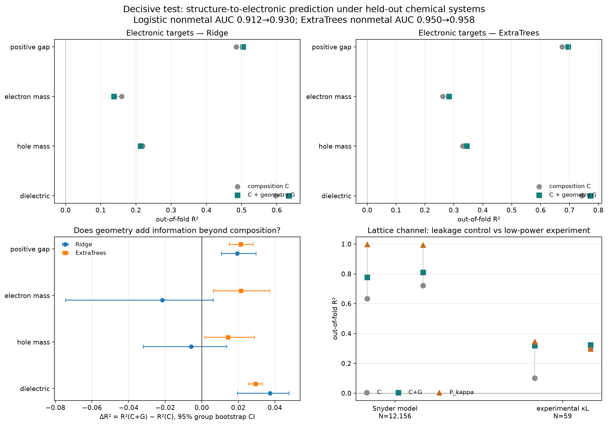

# 不对称结构→电子性质判决性实验

> 运行日期：2026-08-28。该实验对应
> `reports/03_asymmetric_structure_to_transport_plan.md` 第 6 节。

## 结论

**门槛通过，但只通过到“值得建立电子感知结构表示”这一层。**

在 held-out chemical-system 五折交叉验证中，composition-blind 几何 SOAP 相对组成基线，
对正带隙大小和介电响应提供了跨两类模型均稳定的增量：

| 电子目标 | N | Ridge ΔR² [95% CI] | ExtraTrees ΔR² [95% CI] | 判定 |
|---|---:|---:|---:|---|
| `log(1+Eg)`，仅正带隙 | 17,953 | +0.019 [+0.011,+0.030] | +0.021 [+0.015,+0.028] | 稳定但幅度小 |
| `log m*e` | 3,566 | −0.022 [−0.074,+0.006] | +0.021 [+0.006,+0.037] | 模型依赖 |
| `log m*h` | 3,566 | −0.006 [−0.032,+0.014] | +0.014 [+0.002,+0.029] | 模型依赖 |
| `log εgeo` | 44,491 | +0.037 [+0.019,+0.048] | +0.029 [+0.026,+0.033] | 稳定 |

金属/非金属分类也有一致但较小的增益：Logistic AUC `0.912→0.930`，ExtraTrees
`0.950→0.958`。

因此“几何完全没有增量、后续只需组分空间”的否定假设被当前数据拒绝。更准确的结论是：

- 组成仍解释大部分可预测信号；
- 几何对带隙和介电响应有可复现的独立增量；
- 有效质量的几何增量较弱且依赖非线性模型，尚不足以称为稳定映射；
- 可以继续建立**电子感知的结构表示**，但需要把不同电子目标的置信度分别保留。

## 数据与方法

- 电子队列直接使用 55,723 条 JARVIS-DFT 记录及其原生结构，不做 MP 公式复制；多晶型全部保留；
- `C`：118 维元素分数加 44 维加权元素统计，共 162 维 Magpie-style 组成表示；
- `G`：147 维 composition-blind SOAP，使用 JARVIS 优化结构；
- 外层：5-fold GroupKFold，完整 `chemical_system` 留出；
- 模型：固定超参数 Ridge/Logistic 与 ExtraTrees；
- 所有分数均来自 OOF 预测；`ΔR²`/`ΔAUC` 按 chemical system cluster-bootstrap 500 次；
- 不同特征组严格使用相同样本和相同折。

完整 OOF 结果保存在 `processed/asymmetric_mapping_oof.parquet`，可用于后续残差族群审计。

## 晶格通道：泄漏基线按预期成立

| 目标/模型 | C R² | C+G R² | 模型输入代理 Pκ R² | 解释 |
|---|---:|---:|---:|---|
| Snyder 300 K / Ridge | 0.633 | 0.777 | 0.999 | 几乎可由模型相关输入重构 |
| Snyder 300 K / ExtraTrees | 0.721 | 0.811 | 0.994 | 同上 |
| 实验 κL，N=59 / Ridge | 0.101 | 0.319 | 0.346 | ΔR² CI 跨 0 |
| 实验 κL，N=59 / ExtraTrees | 0.302 | 0.324 | 0.297 | ΔR² CI 跨 0 |

Snyder 的 `Pκ` 使用 `bulk/shear/Debye/density/vlong/vtrans/平均质量/nsites`，不是用来宣称预测
能力，而是证明旧图中低 Snyder κL 的强结构可分性主要是模型内生关系。

实验 κL 的几何增量仍未辨识：Ridge ΔR² `+0.218 [−0.032,+0.478]`，ExtraTrees
`+0.021 [−0.150,+0.190]`。N=59 且折间出现负 R²，不能据点估计宣称结构增益。

## 图



上排给出组成与组成+几何的绝对 OOF R²；左下直接显示几何增量及 group-bootstrap CI；右下将
Snyder 泄漏正对照与小样本实验 κL 并列。图中没有候选簇，因为当前数据不能计算同温度绝对
`μW` 和 `B`。

## 现在能做与不能做

可以继续：

1. 用 `C+G → {Eg, m*e, m*h, ε}` 的 OOF 预测建立不对称映射；
2. 对 Gap/介电给予较高置信度，对有效质量保留模型不确定性；
3. 在全维表示中做残差和邻域稳定性审计；
4. MFA/PCA 只作为等权 superblock 的沟通底图，并扫描块权重。

仍不能做：

- 用当前 `σ/τ` 报绝对 `μW`、绝对 `B` 或 zT；
- 把 600 K CRTA 与 300 K Snyder κL 合并排名；
- 把 N=59 实验 κL 上不稳定的点估计称为结构规律；
- 把二维图中的 top-5% 点称为两个物理簇。

## 复现

```bash
export PYTHONPATH=$PWD
python -m mp_kappaL.asymmetric_mapping

# 只有需要重建 55,723 条 JARVIS SOAP 缓存时：
python -m mp_kappaL.asymmetric_mapping --rebuild-features
```

普通复现会读取缓存；完整重建在当前机器约需十分钟，峰值内存约 1–1.5 GB。

