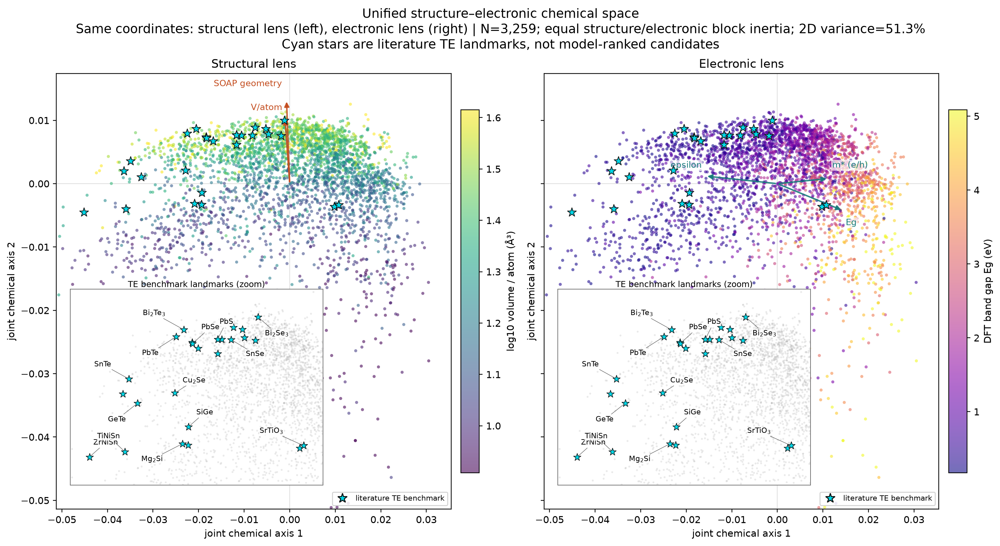

# 统一结构–电子化学空间

## 这张图是什么

这不是把结构视图和电子视图解释成两个对称潜变量，而是一个**不对称映射的可视化层**：先用
结构表示在 chemical-system 分组 CV 中预测电子性质，再把结构 superblock 与可恢复的 OOF
电子性质 superblock 等权融合。



左右两幅图使用**完全相同的坐标和完全相同的 3,259 个点**：

- 左图用原子体积着色，橙色箭头给出 SOAP 几何和 `V/atom` 的相关方向；
- 右图用真实 DFT 带隙着色，绿色箭头给出 `Eg`、电子/空穴平均有效质量与介电响应方向；
- 箭头是性质与二维坐标的相关向量，不是因果方向。
- 青色星形是在当前完整病例中命中的 14 个经典热电基准化学式，共 27 个结构条目；左右图
  标注的是同一批点。小窗放大基准材料所在区域，同一化学式的多晶型全部画出，但只给最接近
  该化学式坐标质心的代表结构标一次化学式。

命中的基准体系为：`Bi2Te3`、`Bi2Se3`、`PbTe`、`PbSe`、`PbS`、`SnSe`、`GeTe`、
`SnTe`、`Cu2Se`、`Mg2Si`、`SiGe`、`TiNiSn`、`ZrNiSn` 和 `SrTiO3`。这些星形是
**预先声明的文献地标**，不是用本图数据筛选出的“优秀候选”，也不表示这些 JARVIS 条目处于其
实验最优掺杂、温度或相态。

## 空间如何构造

1. 完整病例：JARVIS 中同时具有正带隙、`m*e`、`m*h`、`ε` 的 3,259 个半导体；
2. 结构 superblock：162 维组成 + 147 维 composition-blind SOAP，先压到 30 PCs；
3. 电子 superblock：`Eg、m*e、m*h、ε` 的 ExtraTrees `C+G` OOF 预测；
4. 两个 superblock 分别中心化并归一到相同总惯量，再以 1:1 权重拼接；
5. 对拼接表示做 PCA，二维保留 51.3% 的联合方差。

使用 OOF 电子预测而非原始电子标签构造坐标，是为了让电子方向只表示“当前结构描述符可恢复的
电子信息”。无法恢复的电子残差仍保留在 `asymmetric_mapping_oof.parquet`，不被包装成物理
`electronic-private` 空间。

## 图中可以读出的规律

| 二维方向 | 主要相关量 | 相关系数 | 含义 |
|---|---|---:|---|
| joint axis 1 向右 | `Eg` | +0.70 | 带隙增大 |
| joint axis 1 向右 | 平均 `log m*` | +0.55 | 有效质量增大 |
| joint axis 1 向左 | `log ε` | −0.77 | 介电响应增大 |
| joint axis 2 向上 | SOAP geometry PC1 | +0.95 | 主要几何变化方向 |
| joint axis 2 向上 | `log(V/atom)` | +0.75 | 原子体积增大 |

因此这张图实现了一个直观分工：**横向主要是可由结构恢复的电子梯度，纵向主要是几何结构梯度。**
它呈现的是连续流形，不是两个天然分离的簇。

## 权重敏感性

| 结构:电子权重 | 结构总惯量占比 | 15-NN 相对 1:1 的 Jaccard |
|---:|---:|---:|
| 1:2 | 20% | 0.444 |
| 1:1 | 50% | 1.000 |
| 2:1 | 80% | 0.507 |

改变块权重会明显改变局部邻域，因此该二维空间只能用于沟通和提出局部假设，不能单独承载候选材料
或簇的统计论断。正式比较仍使用前一阶段的全维 OOF 指标。

## 为什么只叠加基准地标，不叠加“低 κL 候选”

这 3,259 个点来自 JARVIS 原生结构；当前独立实验 κL 只有 59 个 MP material-level 映射，且没有
同温度绝对 `μW`。把 Snyder `κL` 叠加到这里会重新引入解析模型泄漏。因此当前图先回答“结构
信息和电子结构信息能否在同一空间对应”。新增星形只提供已知热电体系的空间定位，不把二维
位置冒充品质因子或候选排名。

## 复现

```bash
export PYTHONPATH=$PWD
python -m mp_kappaL.unified_chemical_space
```

坐标与权重审计分别保存在：

- `processed/unified_chemical_space_coordinates.csv`
- `processed/unified_chemical_space_te_benchmarks.csv`
- `processed/unified_chemical_space_weight_sensitivity.csv`
- `processed/unified_chemical_space_metadata.json`
