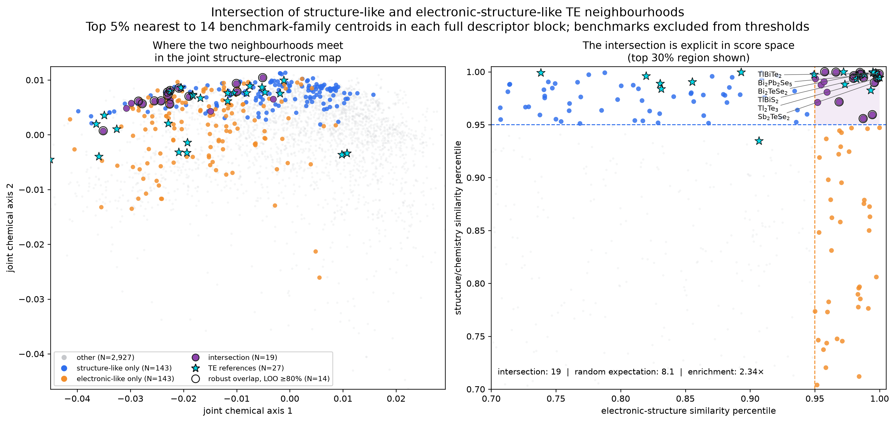

# 结构–电子双空间的热电参考邻域交集

## 为什么上一张图不够

上一张统一空间图只显示结构和电子性质在同一坐标中的连续梯度，没有定义“结构上有利”和
“电子结构上有利”的集合，因此不能从颜色本身读出两个簇的交集。

本图改成一个**参考邻域交集问题**：不使用目前温度、材料身份不一致的 `PF × κL` 标签，而是问
每个材料是否同时接近经典热电材料的结构/化学邻域和电子结构邻域。



图中颜色定义如下：

- 灰色：不属于任一前 5% 参考邻域；
- 蓝色：只在结构/化学空间接近热电基准；
- 橙色：只在电子结构空间接近热电基准；
- 紫色：同时进入两个空间的前 5%，即材料级交集；
- 青色星形：14 个预先声明的基准化学式，共 27 个 JARVIS 结构条目；
- 紫色点外的黑圈：逐一删去一个基准化学式后，至少 80% 重算仍留在交集中的稳定条目。

蓝色、橙色和紫色点的总和是两个参考邻域的并集；紫色点是严格交集。

## 两个空间如何定义

共同队列为 3,259 个同时具有正带隙、电子/空穴有效质量和介电响应的 JARVIS 半导体。

1. **结构/化学空间**：162 维组成描述符 + 147 维 composition-blind SOAP，标准化后保留
   30 个主成分；
2. **电子结构空间**：`log(1+Eg)`、`log(m*e)`、`log(m*h)` 和 `log(ε)`；
3. 对每个基准化学式的所有多晶型分别取质心，得到 14 个参考家族质心；
4. 每个材料在每个空间中的距离定义为“到最近三个不同参考家族质心的平均距离”，避免由某个
   单一多晶型或单一材料家族决定结果；
5. 排除 27 个基准条目后，在剩余 3,232 个材料中分别取距离最小的 5%；
6. 左图把集合投回原来的结构–电子联合坐标；右图直接以两个相似度百分位为轴，所以右上角
   紫色区域就是交集，不再依赖二维 PCA 是否把簇投影清楚。

## 数字结果

| 数量/统计量 | 结果 |
|---|---:|
| 非基准材料 | 3,232 |
| 结构/化学相似前 5% | 162 |
| 电子结构相似前 5% | 162 |
| 实际交集 | 19 条结构、18 个化学式 |
| 独立随机期望 | 8.12 |
| 交集富集 | 2.34× |
| 超几何检验 | `p = 3.57×10⁻⁴` |
| 留一基准家族稳定性 ≥80% | 14 条结构、14 个化学式 |

稳定交集包括：`Bi2Pb2Se5`、`TlBiTe2`、`Tl2Te3`、`Sb2TeSe2`、`Bi2TeSe2`、
`TlBiS2`、`TlSbSe2`、`Bi14Te13S8`、`Bi2Te4Pb`、`SnBi2Te4`、`Cr4InCuSe8`、
`HfGeTe4`、`TlInTe2` 和 `Bi4Te7Pb`。

交集明显富集于重元素硫属化物，尤其是 Bi/Sb/Tl–Te/Se 家族。这说明两套独立描述符对“哪些
材料接近经典热电化学”的判断存在可量化的一致区域。不过，参考集合本身也以硫属化物为主，
所以这个族谱规律部分继承了先验，不能当作从零发现的普适定律。

## 正确解释

这张图终于显示了用户要求的两个簇及其交集，但紫色点的含义严格是：

> 同时在结构/化学描述符和 `Eg–m*–ε` 电子结构描述符上接近已知热电基准家族。

它不是高 `zT`、高 `μW` 或低实验 `κL` 的证明。当前数据仍缺少同一结构、同一温度下的独立
`μW` 与实验/BTE `κL`，因此不能把 19 个交集条目直接发布为候选排名。下一阶段应在这 19 个
交集条目上补算/补齐同温度输运和晶格热导率，将相似性筛选变成真实性能验证。

## 输出与复现

```bash
python -m mp_kappaL.te_reference_intersection
```

- `processed/te_reference_dual_space_membership.csv`：逐材料的两个距离、相似度百分位、集合归属和
  留一基准稳定性；
- `processed/te_reference_dual_space_summary.json`：交集数量、随机期望、富集与检验结果；
- `figures/te_reference_dual_space_intersection.png`：主图。

