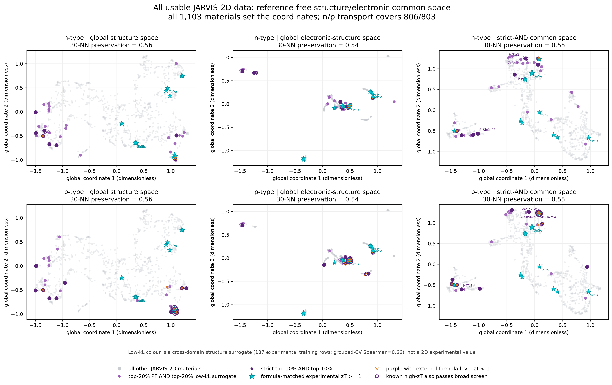

# JARVIS 二维材料：全数据结构–电子共同空间与宽筛选

## 数据范围

这版只研究 JARVIS-2D 材料，没有把三维材料逐行混入二维数据库。

- 结构 SOAP：1,103 个材料，`r_cut=4/6/8 Å`，每块147维。
- Magpie 组分描述符：1,103 × 40。
- 电子结构描述符：1,103 × 9，包括 OptB88vdW/MBJ/HSE 带隙以及电子、空穴有效质量统计。
- n 型输运：806 个材料。
- p 型输运：803 个材料。
- 晶格热导训练标签：137 个 StarryData2–JARVIS-3D 化学式匹配实验值，仅用于训练跨域结构代理。

没有新增 DFT、BTE、声子或输运计算。



## 空间构造

所有1,103个材料共同决定坐标，高-zT、PF 和 kappa_L 标签不参与布局。结构距离先分别在 SOAP-4、SOAP-6、SOAP-8 和 Magpie 子空间计算，再采用无补偿的最差近邻排名：

```text
d_structure(i,j) = max(rank(d_SOAP4), rank(d_SOAP6),
                       rank(d_SOAP8), rank(d_Magpie))
d_electronic(i,j) = rank(d_Eg,effective-mass)
d_joint(i,j) = max(d_structure(i,j), d_electronic(i,j))
```

三个距离分别用 UMAP 降到二维。左列是结构空间，中列是电子结构空间，右列是严格 AND 共同空间。坐标1和2没有单独物理含义，只有点间邻近关系有意义。30近邻保持率分别为结构0.56、电子0.54、共同空间0.55；随机期望约为0.027。

电子图中较多材料挤在一起不是绘图错误，而是 MBJ/HSE/effective-mass 缺失和带隙并列导致的电子描述符退化。缺失指示变量已显式加入，但不能凭空恢复缺失电子信息。

## 紫色如何定义

- 浅紫：PF位于该载流子前20%，同时低-kappa_L结构代理位于前20%。
- 深紫：PF和低-kappa_L代理都位于前10%。
- 青色五角星：StarryData2按约化化学式匹配的实验 `zT >= 1`。
- 紫色空心圈：青色高-zT材料也通过前20%双通道筛选。
- 橙色叉：紫色材料已有外部化学式级 `zT < 1` 报告。

紫色阈值只用于事后标色，不参与坐标。相比原来的前5%，前20%会产生更多紫点，但证据强度也更低，因此同时保留深紫前10%层。

## 数量

| 载流子 | PF覆盖 | 浅紫总数 | 其中深紫 | 已知高-zT标记 | 高-zT且通过浅紫 | 已报道低-zT紫点 |
|---|---:|---:|---:|---:|---:|---:|
| n | 806 | 36 | 10 | 15 | 0 | 2 |
| p | 803 | 38 | 18 | 15 | 2 | 8 |

p 型中同时满足高-zT和宽筛选的是 `Bi2Te3` 与 `Bi2Te2Se`。n 型没有青色点通过双前20%，说明当前 n 型 PF 标签和低-kappa_L代理与外部高-zT标签的一致性较差。

代表性深紫包括：

- n 型：`SrSbSe2F`、`ThTe3`、`HfSe3`、`ZrSe3`、`GeTe4As2`、`HfTe3`、`SbSI`。
- p 型：`HfTe3`、`Sb2Te2Se`、`GeTe4As2`、`Bi2Te2Se`、`CdInGaS4`、`GeBi2Te4`、`SnBi2Te4`。

这些是排序候选，不是已经确认的高-zT材料。

## kappa_L代理的证据等级

低-kappa_L代理使用137个实验训练样本，以SOAP-6和Magpie特征拟合 `log10(kappa_L)`：

- 按化学体系分组5折交叉验证 `R² = 0.450`。
- Spearman = 0.660。
- `log10(kappa_L)` MAE = 0.280。

这个验证说明模型具有中等排序能力，但训练集是三维晶体，目标集是二维材料，存在明显维度和定义域迁移。因此图中的低-kappa_L只能称为结构代理，不能解释为二维材料的实验或严格预测晶格热导率。

## 正确结论

这版确实使用了所有可对齐的二维结构和电子数据，并将紫色候选扩展到 n 型36个、p 型38个。紫点在共同空间中表现为多个局部簇，尤其富集于重元素硫属化物、卤化物和复杂多元化合物区域，而不是单一连续的高-zT簇。

更多紫色来自更宽的前20%筛选，而不是模型突然变得更准确。最值得优先核验的是深紫、没有橙色反例、并位于训练定义域内的材料；完整名单和所有输运字段见候选CSV。

## 文件

- `run_2d_all_data_screen.py`：完整复现脚本。
- `outputs/jarvis_2d_all_points.csv`：n/p全部点、坐标、PF和kappa_L代理。
- `outputs/jarvis_2d_purple_candidates.csv`：74条载流子–材料紫色记录。
- `outputs/jarvis_2d_screen_summary.json`：覆盖、验证和计数。
- `figures/jarvis_2d_global_structure_electronic_screen.pdf`：矢量图。

