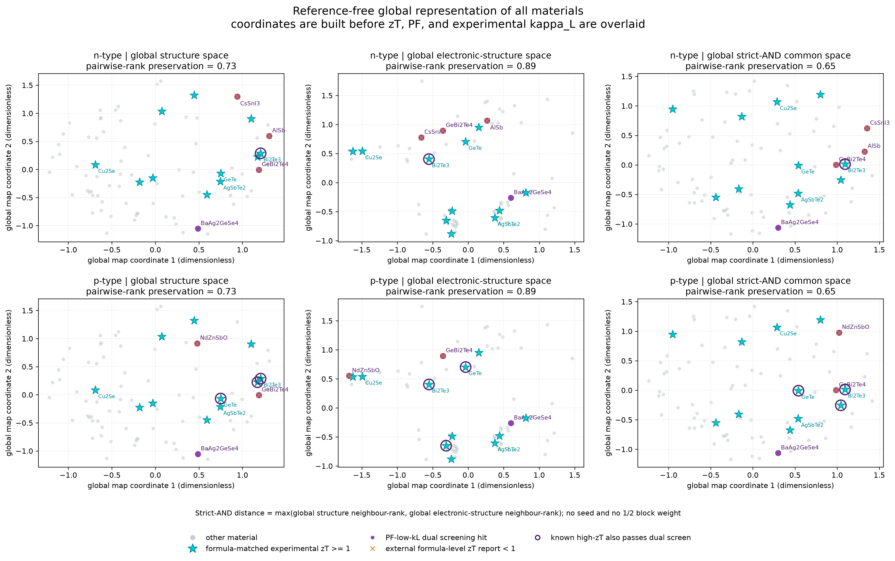
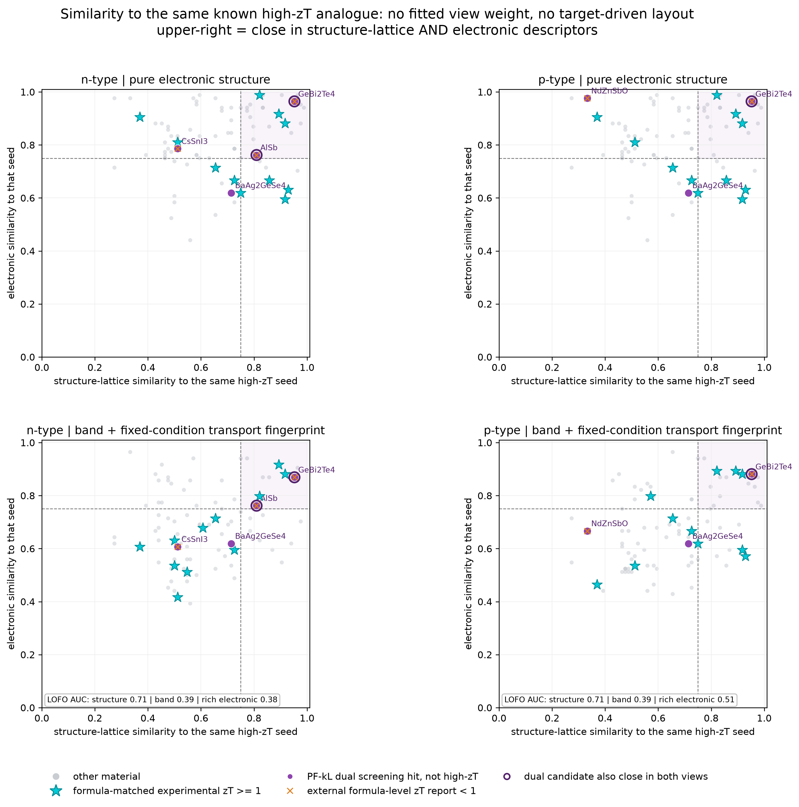
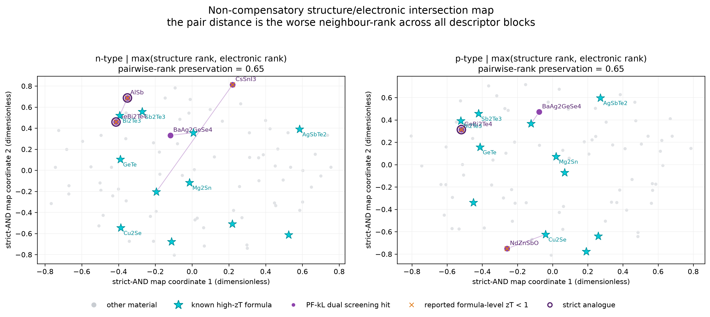

# 结构–电子严格交集空间：现有数据结果

本目录只复用本地已有数据，没有新增 DFT、BTE、声子或输运计算。分析核心集为同时具有 JARVIS 固定条件功率因子和 StarryData2 实验晶格热导率的 85 个材料（n、p 型各 85 个），其中按约化化学式匹配到 11 个实验 `zT >= 1` 材料。化学式匹配不是相/样品条件级标签，青色五角星只能作为弱标签。

## 修正后的主图：全体材料共同空间



这张图不以任何高-zT 材料为参考点。所有 85 个材料先共同生成结构距离、纯电子结构距离，以及二者的严格交集距离：

```text
d_structure(i,j) = max(rank(d_SOAP), rank(d_composition+lattice))
d_electronic(i,j) = rank(d_Eg,m*,dielectric,spillage)
d_common(i,j) = max(d_structure(i,j), d_electronic(i,j))
```

三种全局距离分别用 MDS 降到二维。高-zT、PF、实验 kappa_L 在坐标固定后才叠加标记，完全不参与空间构造；因此这里不存在“选某一个高-zT 点作为原点”的问题。左列为结构空间，中列为纯电子结构空间，右列才是所有材料共享的结构–电子严格交集空间。坐标 1/2 本身没有独立物理意义，只有点间距离有意义。

全局留一 AUC 为：结构 0.692、纯电子结构 0.474、严格共同空间 0.520。n 型只有 1 个已知高-zT 材料同时通过 PF–低-kL 筛选，p 型为 3 个。这说明当前共同空间并没有形成稳定的“高-zT 统一簇”。

## 辅助图：参考材料类比检索，不是共同化学空间



### 类比检索坐标如何得到

结构侧包含两块：147 维 geometry-only SOAP，以及 34 个组分/晶格物理量（元素质量、电负性、原子半径的统计量，密度、原子体积、晶胞原子数、晶格形状、体模量、剪切模量和泊松比等）。纯电子结构侧包含 9 个已有字段：OptB88vdW/MBJ 带隙、电子/空穴有效质量、介电响应和 spillage。增强电子侧再加入 5 个固定条件输运指纹：`|S|`、S 符号、`log sigma`、`log kappa_e`、`log(kappa_e/sigma)`。

没有使用 `1/2 + 1/2` 的加权距离。每个子空间的距离先转成材料内近邻百分位，然后采用严格合取：

```text
d_structure = max(rank(d_SOAP), rank(d_composition+lattice))
d_electronic-rich = max(rank(d_band), rank(d_transport))
d_AND = max(d_structure, d_electronic-rich)
```

因此任一子块不相似，都不能被另一块补偿。相似度平面的横轴和纵轴分别是到同一个高-zT 种子的 `1 - distance rank`；它回答“像哪个已知材料”，不能用于论证全体材料形成共同簇。青色种子自身采用留一化学式结果，避免自匹配得到虚假的 1.0。

增强电子图里的 `S` 和 `sigma` 可以代数重构 PF，因此它只能用于材料类比可视化，不能作为 PF 的独立验证。PF、实验 kappa_L 和外部 zT 均未进入坐标构造。



第二张图把全维 `d_AND` 用度量 MDS 压到二维。坐标 1/2 没有独立物理含义；图中两点接近表示它们在所有结构和电子子块的最差近邻排名仍然接近。二维图只保留约 0.65 的成对距离秩，因此定量判断应以前一张相似度平面和 CSV 为准。

## 定量结果

| 通道 | n 型留一 AUC | p 型留一 AUC |
|---|---:|---:|
| 结构严格合取 | 0.711 | 0.711 |
| 纯电子结构 | 0.388 | 0.388 |
| 固定条件输运指纹 | 0.603 | 0.650 |
| 电子结构 AND 输运指纹 | 0.378 | 0.514 |
| 结构 AND 增强电子 | 0.502 | 0.534 |

结构侧能中等程度找回已知高-zT 化学式；现有纯电子描述符低于随机水平。加入输运指纹只改善了 p 型，且严格合取后 n 型没有改善。这个结果不支持“高-zT 材料在当前结构–电子严格交集空间形成统一簇”。

## 紫色筛选点逐个解释

- `GeBi2Te4`：n/p 型都最接近 `Bi2Te3`；结构相似度 0.952，增强电子相似度分别为 0.869/0.881，是图中最清楚的同族对应。但外部化学式级最大 zT 只有 0.053，因此它同时也是“相似不等于高 zT”的直接反例。
- `AlSb`（n）：到 `Bi2Te3` 的严格相似度 0.762，但实验 kappa_L 为 8.62 W m-1 K-1，进入 Pareto 集主要源于数据库 PF 最大，不是低晶格热导；外部 zT 约 0.011。
- `CsSnI3`（n）：电子侧尚可，但结构严格相似度只有 0.512；外部 zT 约 0.116。
- `NdZnSbO`（p）：带结构相似度高达 0.976，但组分/晶格相似度仅 0.333，说明它是“电子像、结构不像”；外部 zT 约 0.162。
- `BaAg2GeSe4`（n/p）：唯一没有本地外部 zT 标签的筛选点。几何 SOAP 相似度 0.988，但组分/晶格为 0.714、纯电子结构为 0.619，因此未通过严格双视图阈值。它可以保留为待核验对象，但当前证据不足以称为高-zT 候选。

## 正确结论

更丰富的现有描述符确实能识别 `GeBi2Te4`–`Bi2Te3` 这类结构和输运同族关系，但不能把所有 PF–kappa_L 筛选点与已知高-zT 材料聚成一个可靠交集簇。主要瓶颈不是降维，而是电子结构字段缺少能区分热电品质的带谷简并、DOS 有效质量、迁移率/变形势、双极输运等信息；结构侧也缺少非谐性和声子散射信息。

因此，在“不新增计算”的限制下，最诚实的用途是**相似材料检索和反例排除**，不是未知材料的高-zT 判定。若强行让所有紫点靠近青色，只能通过 zT/PF 监督布局或放宽严格合取做到，会造成循环论证。

## 文件

- `run_global_common_space.py`：无参考点的全局共同空间主脚本
- `outputs/global_common_space_points.csv`：全体材料在结构、电子和共同空间中的坐标
- `outputs/global_common_space_summary.json`：全局空间验证统计
- `run_rich_descriptor_and_space.py`：可复现脚本
- `outputs/rich_descriptor_points.csv`：全部 n/p 点和子块相似度
- `outputs/rich_descriptor_candidates.csv`：紫色筛选点、对应高-zT 种子和失败子块
- `outputs/rich_descriptor_summary.json`：方法与验证统计
